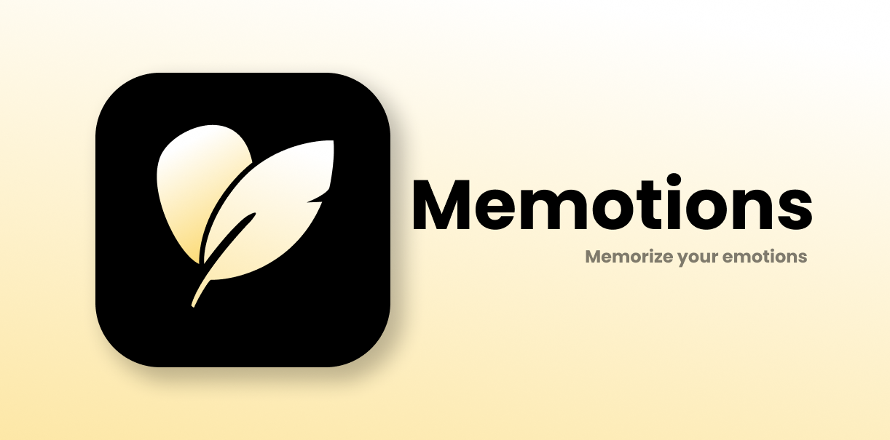

# MEMOTIONS : A Mobile Journaling Application Designed to Support Mental Wellness

## About
Memotions is a mobile journaling application designed to support mental wellness, combining journaling, machine learning, and gamification features like streaks and achievements. The app enables daily journaling with emotion analysis, helping users track emotional patterns and gain valuable insights into their well-being. With early awareness and timely guidance, Memotions empowers you to take control of your mental health journey. Leveraging machine learning and generative AI, it delivers personalized feedback to enhance self-awareness and build emotional resilience..

## Application Preview

 

   
   &nbsp;&nbsp;
   

## Key Features
- Daily journaling for self-reflection and emotional growth.
- AI-powered emotion analysis with personalized feedback.
- Gamified features like streak tracking and achievements.
- Insightful statistics to monitor emotional patterns over time.

 

## Team Members :
| **ID**        | **Name**                                | **Division** | **Social Media**                          |
|:-------------:|:---------------------------------------:|:-----------------:|:-------------------------------------:|
| A014B4KY1881  | I Putu Liangga Ristiana Putra           | MD                | [Github](https://github.com/LianggaRistiana) \| [LinkedIn](https://www.linkedin.com/in/i-putu-liangga-ristiana-putra-62a25221b/) |
| A014B4KY1828  | I Gusti Ngurah Putu Astrawan            | MD                | [Github](https://github.com/WahtuAstrawan) \| [LinkedIn](https://www.linkedin.com/in/i-gusti-ngurah-putu-astrawan/)        |
| M014B4KY1863  | I Nengah Danarsa Suniadevta             | ML                | [Github](https://github.com/devtadanarsa) \| [LinkedIn](https://www.linkedin.com/in/i-nengah-danarsa-suniadevta/)      |
| M014B4KY2895  | Muhammad Ibrahim                        | ML                | [Github](https://github.com/MuhIbrahimm) \| [LinkedIn](https://www.linkedin.com/in/muhibrahimm/)        |
| M319B4KX4166  | Siti Chairini                           | ML                | [Github](https://github.com/rinii19) \| [LinkedIn](https://www.linkedin.com/in/siti-chairini/)                |
| C014B4KY0471  | Anak Agung Indi Kusuma Putra            | CC                | [Github](https://github.com/GungIndi) \| [LinkedIn](https://www.linkedin.com/in/anak-agung-indi-kusuma-putra/)              |
| C014B4KY0825  | Bayu Rizky Kurnia Pratama               | CC                | [Github](https://github.com/bayskie) \| [LinkedIn](https://www.linkedin.com/in/bayurkp/)                |

## Repositories
|   Division   |                                Link                                |
| :----------------: | :----------------------------------------------------------------: |
| Mobile Development | [Github](https://github.com/memotions/memotions-android) |
|  Cloud Computing  | [Backend Services](https://github.com/memotions/backend-service) \| [ML Services](https://github.com/memotions/ml-service) 
|   Machine Learning  | [Github](https://github.com/memotions/memotions-machine-learning)  |

## Project Documents
- [Project Plan](https://docs.google.com/document/d/1vp7IpwWrNyyLlHBM-NFVTOaxSzeX_whDYoKgQ1q90Zw/edit?usp=sharing)
- [Project Brief]()
- [Presentation Videos]()